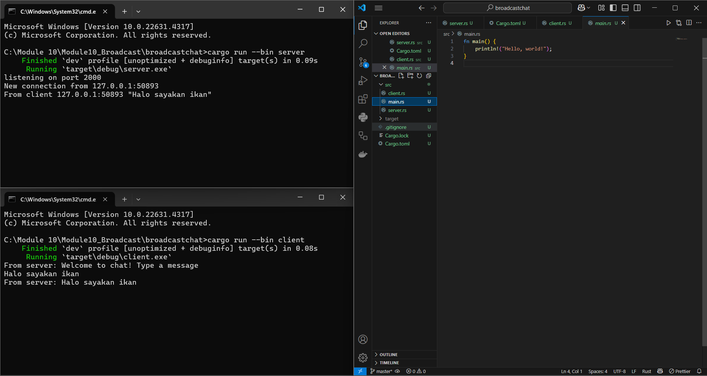

# Original code, and how it run

Open one terminal, start the server:

`cargo run --bin server`

You should see

`listening on port 2000`

Open one or more additional terminals and launch a client in each:

`cargo run --bin client`

Each client will print:

`From server: Welcome to chat! Type a message`

In any client, type a line and hit enter. For example:

`Halo sayakan ikan`

The server terminal logs:

`From client 127.0.0.1:XXXXX "Halo sayakan ikan"`

All connected clients will print:

`From server: Halo sayakan ikan`

Setiap kali seseorang mengetik, server akan mengirimkan pesan tersebut ke semua pelanggan melalui broadcast channel, dan setiap klien akan menangkap pesan itu lewat select-loop-nya lalu mencetaknya ke layar.

# Modifying port

Karena kedua sisi masih menggunakan port 8080, sistem tetap berjalan seperti sebelumnya tanpa perubahan.

# Small changes, add IP and Port

Saat menjalankan beberapa klien di mesin yang sama, akan lebih mudah mengenali terminal mana yang mencetak setiap baris pesan masuk jika ada penanda yang jelas. Menambahkan awalan statis membantu membuat hal itu lebih terlihat.
